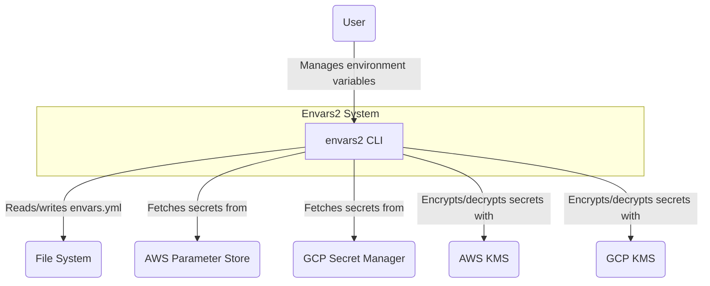
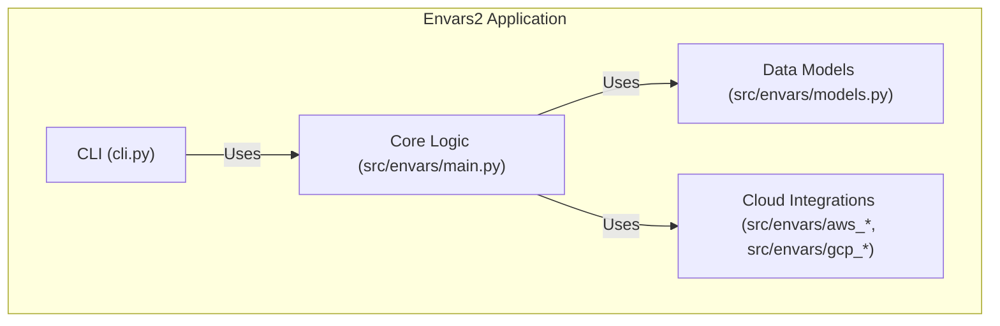
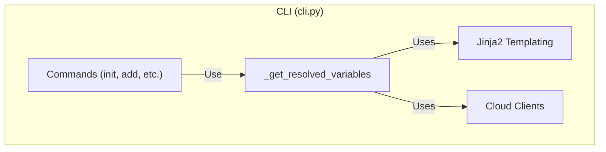
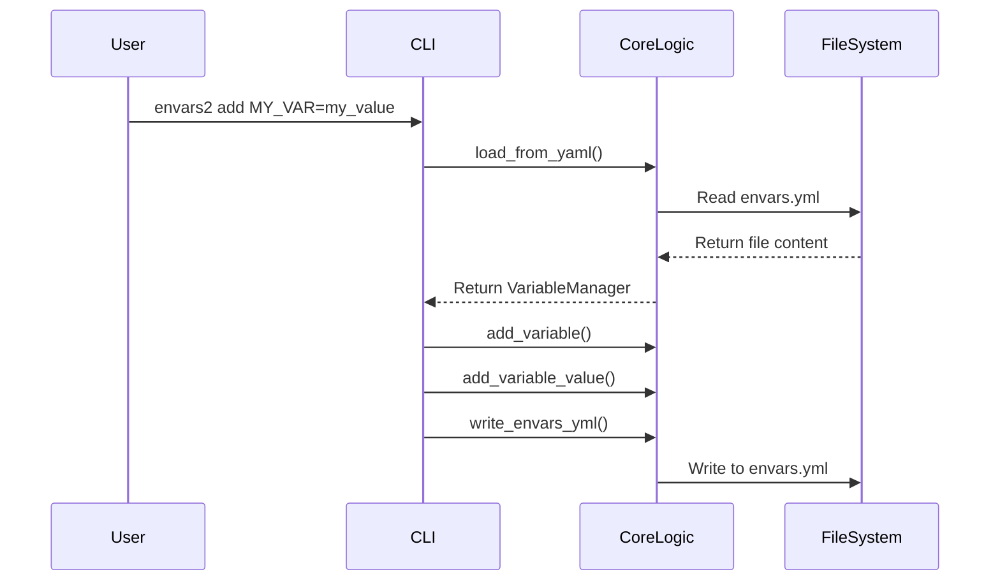
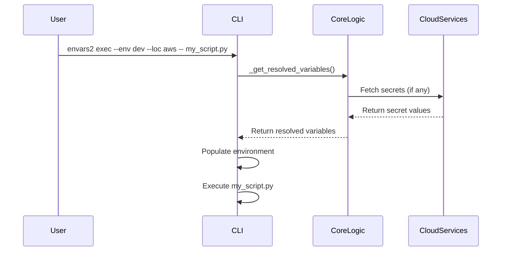

# Envars2 Architecture

Welcome to the Envars2 project! This document provides a comprehensive overview of the application's architecture, key design decisions, and instructions for new developers.

## High-Level Overview

Envars2 is a Python-based command-line interface (CLI) tool designed to simplify the management of environment variables and secrets across multiple environments and cloud providers. It uses a single `envars.yml` file as the source of truth and provides a set of commands to interact with this file and the environment.

The application is built using the `typer` library for the CLI, `pyyaml` for YAML parsing, `jinja2` for templating, and `boto3` and `google-cloud-secret-manager` for cloud integrations.

## C4 Model

The C4 model is used to describe the architecture of a software system at different levels of abstraction.

### Level 1: System Context Diagram

This diagram shows how the `envars2` CLI interacts with users and external systems.



### Level 2: Container Diagram

This diagram breaks down the `envars2` application into its major components.



### Level 3: Component Diagram

This diagram zooms in on the `envars-cli` container and shows the key components and their interactions.



## Sequence Diagrams

These diagrams illustrate the flow of control for key commands.

### `add` Command



### `exec` Command



```

### `exec` Command


## Onboarding Guide

This guide will help new developers get up and running with the `envars2` project.

### Prerequisites

- Python 3.10+
- `uv`

### Setup

1.  **Clone the repository:**
    ```bash
    git clone https://github.com/your-username/envars2.git
    cd envars2
    ```

2.  **Install dependencies:**
    ```bash
    uv sync --all-extras
    ```

3.  **Set up pre-commit hooks:**
    ```bash
    pre-commit install
    ```

### Running Tests

To run the test suite, use the following command:

```bash
uv run pytest
```

### Code Style

This project uses `ruff` for linting and formatting. The pre-commit hooks will automatically format your code and run the linter before each commit.

### Key Modules

-   **`cli.py`**: This file contains all the command-line interface logic, built using `typer`. It's the main entry point for the application.
-   **`src/envars/main.py`**: This file contains the core logic for loading and writing the `envars.yml` file.
-   **`src/envars/models.py`**: This file defines the data models for the application, such as `Variable`, `Environment`, and `Location`.
-   **`src/envars/aws_*.py` and `src/envars/gcp_*.py`**: These files contain the logic for interacting with AWS and GCP services.
-   **`tests/`**: This directory contains all the tests for the application.
